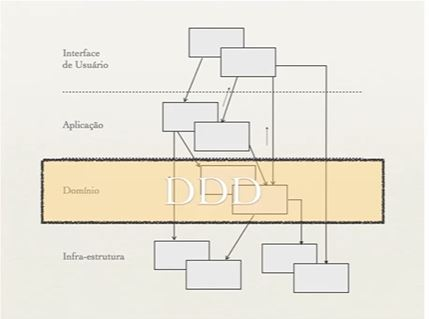

DDD = Domain Driven Design
abordagem de design de sw disciplinada q reúne um conjunto de concitos, técnicas e princípios para construção de sw baseados em um domínio.
- conceitos
  - alinhamento do código com o negócio
  - favorecer reutilização
  - mínimo de acoplamento
  - independência da Tecnologia

- Criando um modelo de domínio (MDD)
  
  - O modelo abstrato deve ser uma representação perfeita do seu domínio. Td q existe no seu negócio deve aparecer no modelo. Só aparece no modelo o que está no negócio.
  - Blocos de construção do MDD - arquitetura em camadas, q dividirá a app em 4 partes:
    - interface de usuário
    - aplicação
    - domínio  -> TODO o foco de DDD está nessa camada.
    - infra-estrutura - partes de um sitema responsaveis por persistência de dados, conexões com bd, envio de msgs por redes, gravação e leitura de discos...

- Regras para modelagem do domínio
  - entidades
  - obj de valores
  - agregados
  - fábricas
  - serviços -  não guardam estados
  - repositórios
  - módulos